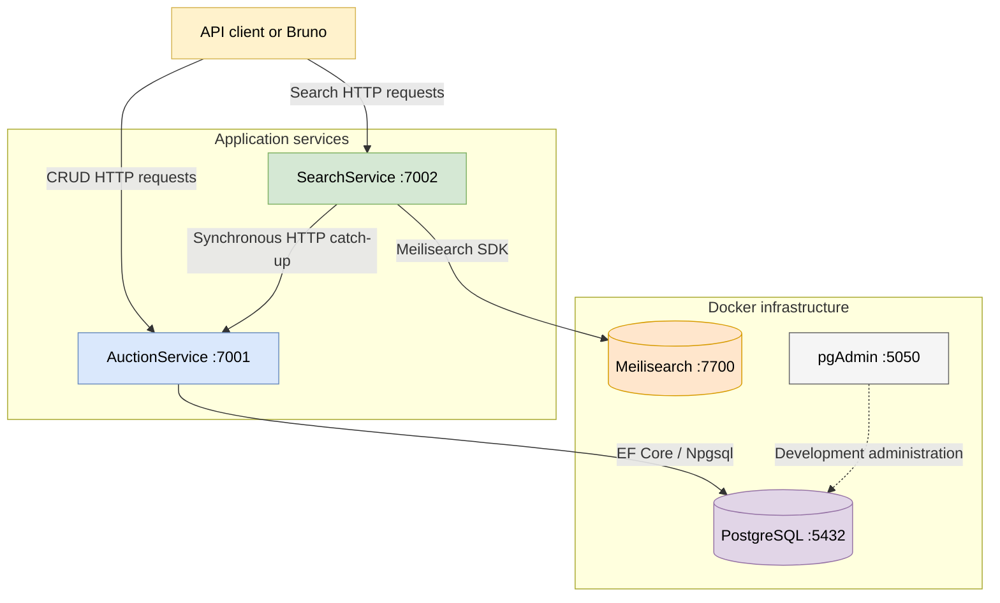
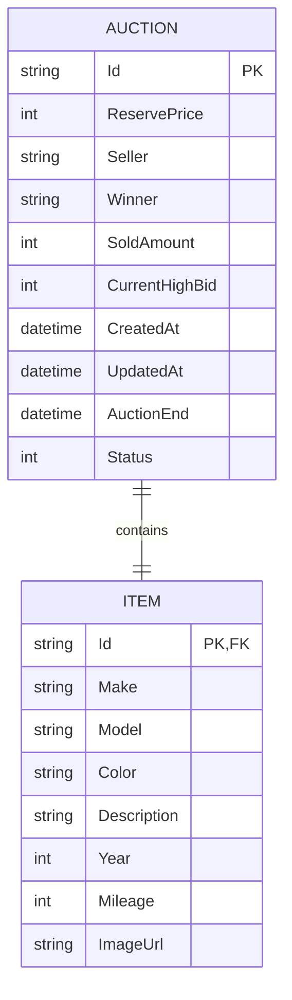
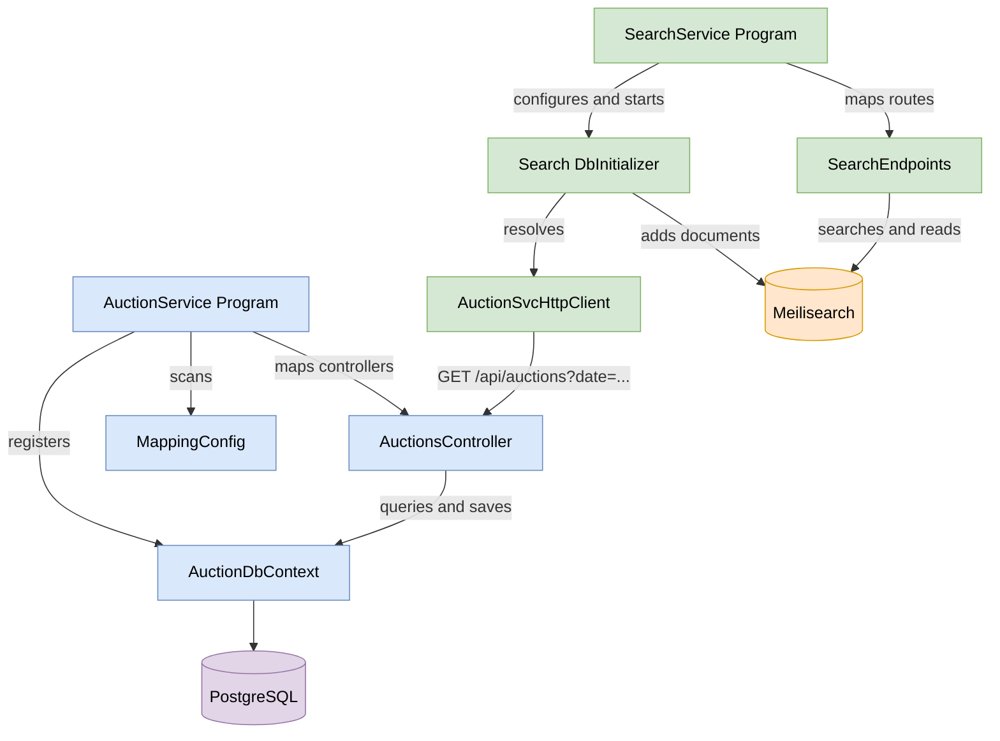
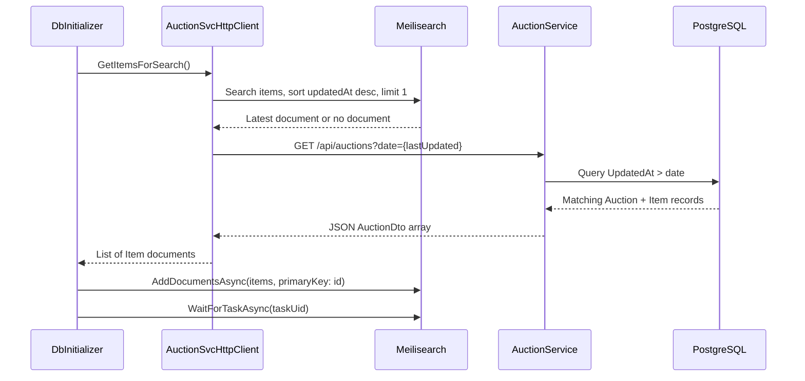
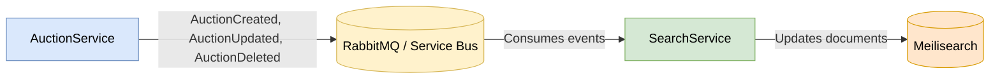

# Carsties — Current Microservices Architecture

> [!IMPORTANT]
> **Work in progress:** Carsties is still under active development. This document describes the repository as it exists on the `main` branch at the time of writing. It may be updated as new services, features, databases, and communication mechanisms are added.
>
> The primary goal of this project is to **learn and practise microservices architecture** by building a real application step by step.

## Table of contents

1. [Current scope](#current-scope)
2. [Architecture at a glance](#architecture-at-a-glance)
3. [Component responsibilities](#component-responsibilities)
4. [Data ownership and data models](#data-ownership-and-data-models)
5. [Communication mechanisms](#communication-mechanisms)
6. [How the main classes are connected](#how-the-main-classes-are-connected)
7. [Application startup flows](#application-startup-flows)
8. [Main application flows](#main-application-flows)
9. [HTTP endpoint reference](#http-endpoint-reference)
10. [Resilience and failure behaviour](#resilience-and-failure-behaviour)
11. [Docker infrastructure](#docker-infrastructure)
12. [Current limitations and planned evolution](#current-limitations-and-planned-evolution)
13. [Quick mental model](#quick-mental-model)

## Current scope

The solution currently contains two application services:

- **AuctionService** — owns auction data and supports CRUD operations.
- **SearchService** — owns a read-optimised search index and supports searching, filtering, sorting, pagination, and lookup by ID.

The local infrastructure contains:

- **PostgreSQL** — the authoritative database for AuctionService.
- **Meilisearch** — the denormalised search index for SearchService.
- **pgAdmin** — a development administration interface for PostgreSQL. It is not part of the runtime data flow.

The following major components are **not implemented yet**:

- RabbitMQ/service-bus communication
- event-driven index updates
- IdentityService and authentication
- BidService
- NotificationService
- API Gateway
- client web application
- containerisation of the two .NET services

At present, the .NET services run on the host machine while PostgreSQL, Meilisearch, and pgAdmin run in Docker.

## Architecture at a glance



### The central architectural idea

PostgreSQL is the **source of truth**. Meilisearch contains a flattened, searchable copy of auction data.

```text
PostgreSQL = authoritative write model
Meilisearch = derived read/search model
```

Clients create, update, and delete auctions through AuctionService. Clients search and browse auction summaries through SearchService.

SearchService currently synchronises missing or updated auction documents from AuctionService during SearchService startup. This is a synchronous HTTP catch-up mechanism, not yet real-time event-driven communication.

## Component responsibilities

| Component | Responsibility | Owns data? | Main technology |
|---|---|---:|---|
| AuctionService | Create, read, update, and delete auctions | Yes | ASP.NET Core controllers, EF Core, Mapster |
| PostgreSQL | Persist authoritative auction and item records | Yes | PostgreSQL 18 |
| SearchService | Search, filter, sort, paginate, and read indexed auction documents | Yes, derived copy | ASP.NET Core Minimal APIs, Meilisearch SDK |
| Meilisearch | Store and query denormalised auction documents | Yes, derived copy | Meilisearch |
| pgAdmin | Allow a developer to inspect PostgreSQL visually | No | pgAdmin 4 |
| Docker Compose | Start local infrastructure and attach persistent volumes | No | Docker Compose |

### AuctionService

AuctionService is the current write service and authoritative owner of auctions.

Its main responsibilities are:

- apply EF Core migrations at startup;
- seed ten development auctions when the database is empty;
- expose REST CRUD endpoints;
- enforce basic update/delete rules;
- store `Auction` and `Item` entities in PostgreSQL;
- return flattened `AuctionDto` objects;
- provide a date-based endpoint used by SearchService for catch-up synchronisation.

### SearchService

SearchService is the current read/search service.

Its main responsibilities are:

- configure the `items` Meilisearch index;
- fetch missing or updated auctions from AuctionService at startup;
- index auction documents in Meilisearch;
- retry temporary HTTP failures when AuctionService is unavailable;
- expose search and get-by-ID Minimal API endpoints.

## Data ownership and data models

### AuctionService relational model

AuctionService stores two relational tables with a required one-to-one relationship. The same ID is used as the primary key of both records and as the `Items` foreign key to `Auctions`.



The relationship is configured in `AuctionDbContext.OnModelCreating()`:

```text
Auction.HasOne(Auction.Item)
       .WithOne(Item.Auction)
       .HasForeignKey<Item>(Item.Id)
```

Deleting an `Auction` cascades to its related `Item` at database level.

### API DTO model

`AuctionDto` flattens the two relational entities into one transport object:

```text
Auction fields + Item fields → AuctionDto
```

`MappingConfig.Register()` configures Mapster to map nested `Item` properties such as `Make`, `Model`, and `Description` into top-level `AuctionDto` properties.

### Search document model

`SearchService.Models.Item` has approximately the same flat shape as `AuctionDto`. Each instance is stored as one document in the Meilisearch `items` index.

```json
{
  "id": "ferrari-spider",
  "reservePrice": 20000,
  "seller": "bob",
  "updatedAt": "2026-09-18T08:30:00Z",
  "auctionEnd": "2026-11-02T08:30:00Z",
  "status": "Live",
  "make": "Ferrari",
  "model": "Spider",
  "description": "..."
}
```

The document ID is the Meilisearch primary key. Adding a full document with an existing ID replaces that indexed document with the newer representation.

## Communication mechanisms

### 1. Client to AuctionService

- **Protocol:** HTTP REST
- **Format:** JSON
- **Style:** synchronous request/response
- **Purpose:** auction CRUD operations

Example:

```http
POST http://localhost:7001/api/auctions
Content-Type: application/json
```

### 2. AuctionService to PostgreSQL

- **Library:** Entity Framework Core
- **Provider:** Npgsql
- **Purpose:** migrations, queries, inserts, updates, and deletes
- **Connection:** `localhost:5432`, database `auctions`

### 3. SearchService to AuctionService

- **Protocol:** HTTP REST
- **Client:** typed `HttpClient` in `AuctionSvcHttpClient`
- **Format:** JSON array compatible with `List<SearchService.Models.Item>`
- **Style:** synchronous request/response, initiated in a background startup task
- **Purpose:** fetch auctions newer than the most recently indexed `UpdatedAt` value

Example:

```http
GET http://localhost:7001/api/auctions?date=2026-09-18T08%3A30%3A00.0000000Z
```

### 4. SearchService to Meilisearch

- **Library:** `MeilisearchClient`
- **Protocol underneath the SDK:** HTTP
- **Index:** `items`
- **Purpose:** configure settings, add documents, search, and retrieve documents

### 5. Communication not present yet

There is currently no RabbitMQ, message bus, domain-event publication, or event consumption in the implemented services. Therefore, auction changes are not pushed to SearchService in real time.

## How the main classes are connected



### Key class and method map

| Project | Class | Important method | Role |
|---|---|---|---|
| AuctionService | `Program` | top-level startup code | Scans Mapster mappings, registers controllers and EF Core, enables exception handling, runs database initialisation |
| AuctionService | `DbInitializer` | `InitDb()` | Creates a DI scope and resolves `AuctionDbContext` |
| AuctionService | `DbInitializer` | `SeedData()` | Runs migrations and inserts seed auctions when the database is empty |
| AuctionService | `AuctionDbContext` | `OnModelCreating()` | Configures the required one-to-one `Auction`–`Item` relationship |
| AuctionService | `MappingConfig` | `Register()` | Defines entity/DTO mappings and flattening rules |
| AuctionService | `AuctionsController` | `GetAuctions()` | Returns all auctions or only auctions updated after an optional date |
| AuctionService | `AuctionsController` | `GetAuction()` | Returns one auction by ID |
| AuctionService | `AuctionsController` | `CreateAuction()` | Maps input, assigns the temporary seller, saves the aggregate, returns `201 Created` |
| AuctionService | `AuctionsController` | `UpdateAuction()` | Rejects missing auctions or auctions with bids, updates item fields and `UpdatedAt`, saves changes |
| AuctionService | `AuctionsController` | `DeleteAuction()` | Rejects missing auctions or auctions with bids, deletes the aggregate |
| AuctionService | `GlobalExceptionHandler` | `TryHandleAsync()` | Logs unhandled exceptions and returns an HTTP 500 Problem Details response |
| SearchService | `Program` | top-level startup code | Registers Meilisearch and resilient `HttpClient`, maps Minimal API routes, configures index, starts background catch-up |
| SearchService | `DbInitializer` | `ConfigureIndex()` | Configures searchable, filterable, and sortable Meilisearch attributes |
| SearchService | `DbInitializer` | `FetchMissingAuctions()` | Resolves `AuctionSvcHttpClient`, downloads missing/updated items, and indexes them |
| SearchService | `AuctionSvcHttpClient` | `GetItemsForSearch()` | Finds the latest indexed timestamp and requests newer auctions from AuctionService |
| SearchService | `SearchEndpoints` | `GetSearchResults()` | Builds filters, sorting, and pagination, then queries Meilisearch |
| SearchService | `SearchEndpoints` | `GetAuctionById()` | Reads one indexed document and converts `document_not_found` to HTTP 404 |

## Application startup flows

### Flow A — AuctionService startup

| Step | Class and method | What happens |
|---:|---|---|
| 1 | `Program` — top-level startup | `MappingConfig` implementations are discovered through `TypeAdapterConfig.GlobalSettings.Scan()` |
| 2 | `Program` — top-level startup | Controllers, `AuctionDbContext`, Npgsql, `GlobalExceptionHandler`, and Problem Details are registered |
| 3 | `Program` — top-level startup | The HTTP exception-handling middleware and controller routes are enabled |
| 4 | `DbInitializer.InitDb()` | A dependency-injection scope is created and `AuctionDbContext` is resolved |
| 5 | `DbInitializer.SeedData()` | `Database.Migrate()` applies pending EF Core migrations |
| 6 | `DbInitializer.SeedData()` | If `Auctions` already contains data, seeding stops |
| 7 | `DbInitializer.SeedData()` | Otherwise, ten `Auction` aggregates with nested `Item` objects are inserted and saved |
| 8 | `Program` — `app.Run()` | AuctionService begins listening on `http://localhost:7001` in the development profile |

### Flow B — SearchService startup

| Step | Class and method | What happens |
|---:|---|---|
| 1 | `Program` — top-level startup | A singleton `MeilisearchClient` is created from `MeiliSearch:Url` and `MeiliSearch:ApiKey` |
| 2 | `Program` — top-level startup | A typed `HttpClient` for `AuctionSvcHttpClient` is registered with the standard resilience handler |
| 3 | `Program` — top-level startup | `/api/search` and `/api/search/{id}` are mapped to `SearchEndpoints` methods |
| 4 | `DbInitializer.ConfigureIndex()` | The `items` index is selected and its searchable, filterable, and sortable fields are configured |
| 5 | `DbInitializer.ConfigureIndex()` | `WaitForTaskAsync()` waits until Meilisearch finishes applying its settings |
| 6 | `Program` — `Task.Run()` | `FetchMissingAuctions()` is launched without blocking the web server startup |
| 7 | `Program` — `app.Run()` | SearchService begins listening on `http://localhost:7002` while catch-up continues in the background |

### Flow C — Startup catch-up synchronisation



Detailed algorithm:

| Step | Class and method | What happens |
|---:|---|---|
| 1 | `DbInitializer.FetchMissingAuctions()` | Resolves `MeilisearchClient`, selects the `items` index, creates a DI scope, and resolves `AuctionSvcHttpClient` |
| 2 | `AuctionSvcHttpClient.GetItemsForSearch()` | Searches Meilisearch with an empty search term, sorted by `updatedAt:desc`, limited to one hit |
| 3 | `AuctionSvcHttpClient.GetItemsForSearch()` | Reads the latest indexed `UpdatedAt`; if the index is empty, the value is `null` |
| 4 | `AuctionSvcHttpClient.GetItemsForSearch()` | Formats the timestamp with the round-trip `O` format, or uses an empty string on first startup |
| 5 | `AuctionSvcHttpClient.GetItemsForSearch()` | URI-encodes the date and calls `GET {AuctionSvcUrl}/api/auctions?date=...` |
| 6 | `AuctionsController.GetAuctions()` | Parses the optional date as UTC and returns HTTP 400 if it is invalid |
| 7 | `AuctionsController.GetAuctions()` | If a date exists, applies `UpdatedAt > parsedDate`; otherwise, returns all auctions |
| 8 | `AuctionsController.GetAuctions()` + `MappingConfig.Register()` | `ProjectToType<AuctionDto>()` projects and flattens the relational entities into JSON DTOs |
| 9 | `AuctionSvcHttpClient.GetItemsForSearch()` | `GetFromJsonAsync<List<Item>>()` deserialises the JSON response into SearchService documents |
| 10 | `DbInitializer.FetchMissingAuctions()` | Stops when there are no newer items; otherwise, adds/replaces documents using `id` as the primary key |
| 11 | `DbInitializer.FetchMissingAuctions()` | Waits for the asynchronous Meilisearch indexing task to complete |

On the first run, Meilisearch has no documents, so `date` is empty and AuctionService returns all auctions. On later SearchService starts, only auctions newer than the latest indexed timestamp are requested.

## Main application flows

### Flow D — Search and browse auctions

Example:

```http
GET http://localhost:7002/api/search?searchTerm=ford&seller=bob&filterBy=live&orderBy=make&pageNumber=1&pageSize=10
```

| Step | Class and method | What happens |
|---:|---|---|
| 1 | `Program` — route mapping | ASP.NET Core selects `SearchEndpoints.GetSearchResults()` for `GET /api/search` |
| 2 | `SearchEndpoints.GetSearchResults()` | `MeilisearchClient` is injected; query-string values are bound to method parameters |
| 3 | `SearchEndpoints.GetSearchResults()` | Seller, winner, and date filters are assembled and joined with `AND` |
| 4 | `SearchEndpoints.GetSearchResults()` | `orderBy` is translated into Meilisearch sorting instructions |
| 5 | `SearchEndpoints.GetSearchResults()` | Page numbers below 1 become 1; page sizes above 50 are capped at 50 |
| 6 | `SearchEndpoints.GetSearchResults()` | `SearchAsync<Item>()` queries the `items` index |
| 7 | `SearchEndpoints.GetSearchResults()` | Returns HTTP 200 with `results`, `pageCount`, and `totalCount` |

Supported current filters and sorts:

| Parameter | Values/behaviour |
|---|---|
| `searchTerm` | Full-text search across `make`, `model`, and `description` |
| `seller` | Exact seller filter |
| `winner` | Exact winner filter |
| `filterBy=live` | `auctionEnd` is after the current UTC time |
| `filterBy=finished` | `auctionEnd` is before the current UTC time |
| `filterBy=endingSoon` | Auction ends between now and six hours from now |
| `orderBy=make` | `make:asc`, then `model:asc` |
| `orderBy=new` | `createdAt:desc` |
| `orderBy=endingSoon` | `auctionEnd:asc` |

### Flow E — Get one indexed auction by ID

| Step | Class and method | What happens |
|---:|---|---|
| 1 | `Program` — route mapping | `/api/search/{id}` maps to `SearchEndpoints.GetAuctionById()` |
| 2 | `SearchEndpoints.GetAuctionById()` | Reads the route ID and requests the document through `GetDocumentAsync<Item>(id)` |
| 3 | `SearchEndpoints.GetAuctionById()` | Returns HTTP 200 with the document when found |
| 4 | `SearchEndpoints.GetAuctionById()` | Converts Meilisearch error code `document_not_found` into HTTP 404 |

This endpoint currently exists primarily to make future asynchronous-communication testing easy. AuctionService remains the authoritative owner of auction details.

### Flow F — Create an auction

| Step | Class and method | What happens |
|---:|---|---|
| 1 | `AuctionsController.CreateAuction()` | ASP.NET Core validates and binds the JSON body to `CreateAuctionDto` |
| 2 | `MappingConfig.Register()` | Mapster maps `CreateAuctionDto` to `Auction` and maps the same input into the nested `Auction.Item` |
| 3 | `AuctionsController.CreateAuction()` | The temporary seller value `TODO: seller` is assigned because authentication is not implemented yet |
| 4 | `AuctionDbContext` + `SaveChangesAsync()` | EF Core inserts the `Auction` and related `Item` in one unit of work |
| 5 | `AuctionsController.CreateAuction()` | Returns HTTP 201 with a `Location` header pointing to `GetAuction()` |
| 6 | Current synchronisation behaviour | SearchService is **not notified immediately**. The new auction reaches Meilisearch on a later SearchService startup catch-up |

### Flow G — Update an auction

| Step | Class and method | What happens |
|---:|---|---|
| 1 | `AuctionsController.UpdateAuction()` | EF Core finds the auction by ID |
| 2 | `AuctionsController.UpdateAuction()` | Returns HTTP 404 if missing; returns HTTP 400 when `CurrentHighBid > 0` |
| 3 | `AuctionsController.UpdateAuction()` | Sets `Auction.UpdatedAt = DateTime.UtcNow` |
| 4 | `MappingConfig.Register()` + `Adapt()` | Non-null `UpdateAuctionDto` properties are mapped to `auction.Item` |
| 5 | `AuctionDbContext` + `SaveChangesAsync()` | EF Core saves tracked changes and the endpoint returns HTTP 204 |
| 6 | Current synchronisation behaviour | SearchService discovers the newer `UpdatedAt` on its next startup and replaces the indexed document |

> [!NOTE]
> The current code maps `UpdateAuctionDto` to `auction.Item`. Consequently, item-level fields are updated, but the DTO's auction-level `ReservePrice` and `AuctionEnd` values are not currently applied to the `Auction` entity.

### Flow H — Delete an auction

| Step | Class and method | What happens |
|---:|---|---|
| 1 | `AuctionsController.DeleteAuction()` | EF Core finds the auction by ID |
| 2 | `AuctionsController.DeleteAuction()` | Returns HTTP 404 if missing; returns HTTP 400 when `CurrentHighBid > 0` |
| 3 | `AuctionsController.DeleteAuction()` | Removes the auction and saves changes; the related item is deleted by cascade |
| 4 | `AuctionsController.DeleteAuction()` | Returns HTTP 204 |
| 5 | Current synchronisation behaviour | No deletion message is sent to SearchService, so the old Meilisearch document can remain until the index is rebuilt or future event handling is implemented |

## HTTP endpoint reference

### AuctionService — `http://localhost:7001`

| Method | Route | Handler | Purpose |
|---|---|---|---|
| GET | `/api/auctions?date={optionalDate}` | `AuctionsController.GetAuctions()` | Get all auctions or auctions updated after a UTC date |
| GET | `/api/auctions/{id}` | `AuctionsController.GetAuction()` | Get one authoritative auction DTO |
| POST | `/api/auctions` | `AuctionsController.CreateAuction()` | Create an auction |
| PUT | `/api/auctions/{id}` | `AuctionsController.UpdateAuction()` | Update an auction when it has no bids |
| DELETE | `/api/auctions/{id}` | `AuctionsController.DeleteAuction()` | Delete an auction when it has no bids |

### SearchService — `http://localhost:7002`

| Method | Route | Handler | Purpose |
|---|---|---|---|
| GET | `/api/search` | `SearchEndpoints.GetSearchResults()` | Search, filter, sort, and paginate indexed auctions |
| GET | `/api/search/{id}` | `SearchEndpoints.GetAuctionById()` | Get one indexed document for testing/read purposes |

## Resilience and failure behaviour

`AuctionSvcHttpClient` uses `AddStandardResilienceHandler()` with the following current configuration:

| Setting | Current value | Meaning |
|---|---:|---|
| Total request timeout | 3 minutes | Maximum total time allowed for the request pipeline |
| Maximum retry attempts | 5 | Retry temporary failures up to five times |
| Retry delay | 10 seconds | Base delay configured between retries |
| Retry callback | Console message | Logs the retry attempt number |

The catch-up call runs in a fire-and-forget `Task.Run()` block. This allows SearchService to start accepting HTTP requests even if AuctionService is unavailable.

Failure scenarios:

| Scenario | Current behaviour |
|---|---|
| AuctionService is unavailable during SearchService startup | Background HTTP retries occur; SearchService can still start |
| Meilisearch already has data | Search endpoints can return the existing, possibly stale data |
| Meilisearch is empty | Search endpoints return empty results until catch-up succeeds |
| Retry policy is exhausted | The exception is caught and written to the console; no further automatic catch-up occurs during that process lifetime |
| Meilisearch configuration fails | The startup exception is caught; the application continues toward startup, but search behaviour may be unavailable or incorrect |

> [!NOTE]
> `Task.Run()` is useful for this learning stage. A production implementation would normally use `BackgroundService`/`IHostedService`, cancellation tokens, structured logging, health checks, and observability.

## Docker infrastructure

The current `docker-compose.yml` starts three infrastructure containers:

| Compose service | Image | Host port | Container port | Persistent volume |
|---|---|---:|---:|---|
| `postgres` | `postgres:18` | 5432 | 5432 | `postgres_data` |
| `pgadmin` | `dpage/pgadmin4:latest` | 5050 | 80 | `pgadmin_data` |
| `meilisearch` | `getmeili/meilisearch:latest` | 7700 | 7700 | `meilisearch_data` |

Current local addresses:

```text
AuctionService: http://localhost:7001
SearchService:  http://localhost:7002
PostgreSQL:     localhost:5432
pgAdmin:        http://localhost:5050
Meilisearch:    http://localhost:7700
```

The normal infrastructure startup command is:

```powershell
docker compose up -d
```

> [!CAUTION]
> `docker compose down -v` deletes the PostgreSQL, pgAdmin, and Meilisearch volumes. Use it only when intentionally resetting all local data.

## Current limitations and planned evolution

### Implemented now

- Two independently running .NET services
- Database-per-service-style separation between PostgreSQL and Meilisearch
- Auction CRUD through AuctionService
- Search, filter, sorting, and pagination through SearchService
- Synchronous HTTP startup catch-up
- HTTP retry and total-timeout resilience
- Background catch-up that does not block SearchService startup
- Global exception handling in AuctionService
- Dockerised development infrastructure

### Important current limitations

1. **No real-time index updates.** Creates and updates reach Meilisearch only when `FetchMissingAuctions()` runs during SearchService startup.
2. **Deletes are not propagated.** Timestamp-based catch-up cannot discover that an auction was deleted.
3. **Synchronous coupling remains.** SearchService knows AuctionService's address and depends on its HTTP contract for catch-up.
4. **Catch-up runs once per process.** If all retries fail, there is no scheduled retry loop afterward.
5. **No authentication or ownership.** New auctions currently receive the placeholder seller `TODO: seller`.
6. **No service bus.** RabbitMQ/event-driven communication is not implemented yet.
7. **No API Gateway or client application.** Clients currently call service ports directly.
8. **Development secrets are committed.** PostgreSQL, pgAdmin, and Meilisearch use simple local-study credentials; production secrets require secure configuration.
9. **SearchService contains legacy seed artifacts.** `Data/auctions.json`, its project-file copy rule, and some JSON-related comments remain even though runtime catch-up now uses AuctionService.
10. **Update mapping is incomplete.** `ReservePrice` and `AuctionEnd` from `UpdateAuctionDto` are not currently applied to the `Auction` entity.
11. **The explicit read mapping should be checked for `Color`.** `MappingConfig.Register()` explicitly maps several nested `Item` fields into `AuctionDto`, but it does not explicitly map `Item.Color`; verify the returned value and add the mapping if necessary.

### Expected architectural direction

The planned event-driven direction is:



In that architecture:

- AuctionService publishes facts about completed changes.
- SearchService consumes those events independently.
- AuctionService does not call SearchService directly.
- SearchService does not need to poll AuctionService for every change.
- temporary SearchService downtime does not necessarily lose events because messages can remain in the broker.
- Meilisearch becomes eventually consistent with PostgreSQL.

The existing HTTP catch-up mechanism can still remain useful as a recovery mechanism for missed events or a newly created search index.

## Quick mental model

Think of the current application as two specialised departments:

- **AuctionService is the official records office.** It owns the authoritative auction data in PostgreSQL.
- **SearchService is the searchable catalogue.** It stores a fast, flattened copy in Meilisearch.

At present, the catalogue asks the records office for changes when SearchService starts:

```text
SearchService startup
    → find latest indexed UpdatedAt
    → ask AuctionService for newer auctions
    → add or replace Meilisearch documents
```

User requests then follow one of two paths:

```text
Create/update/delete → AuctionService → PostgreSQL
Search/filter/sort   → SearchService  → Meilisearch
```

This is the current learning-stage architecture. Future sections will add asynchronous messaging and additional microservices, changing how data is propagated while preserving the core rule that each service owns its own data and responsibilities.

---

**Suggested repository location:** `Documents/Carsties-Current-Architecture.md`
