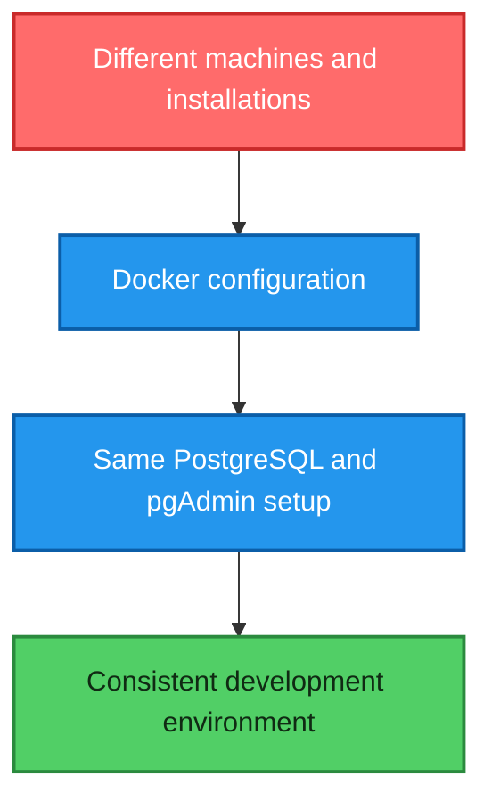
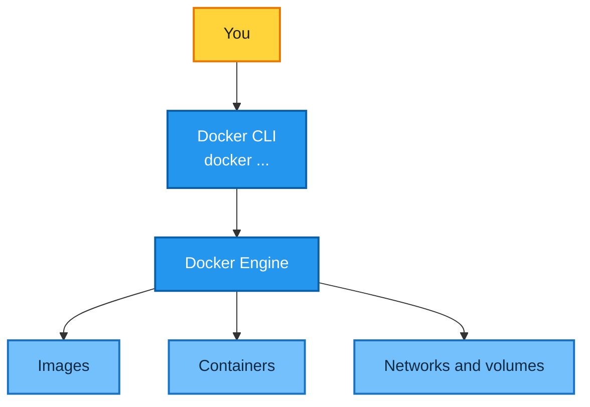
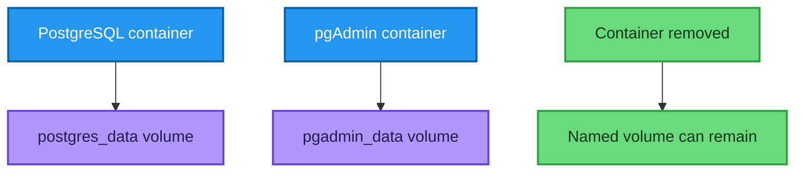
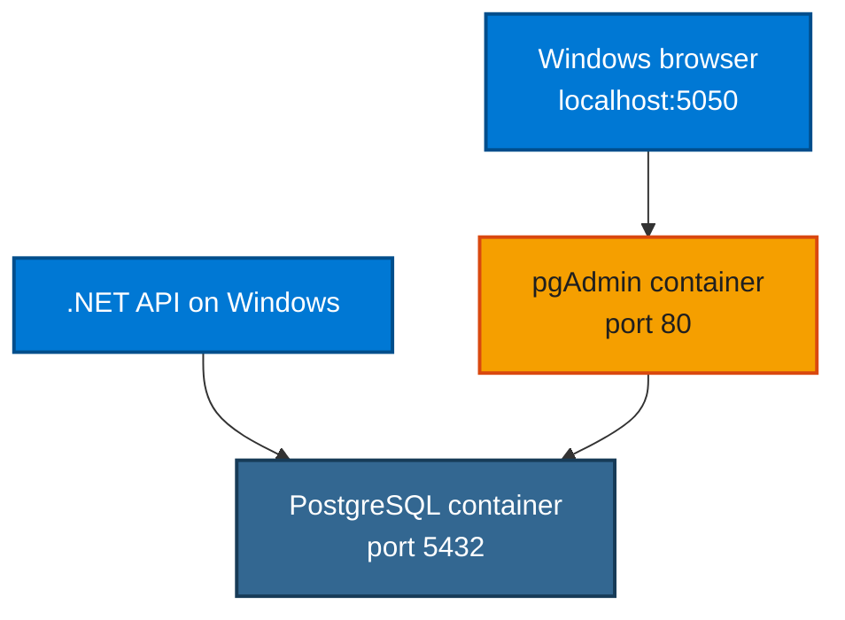
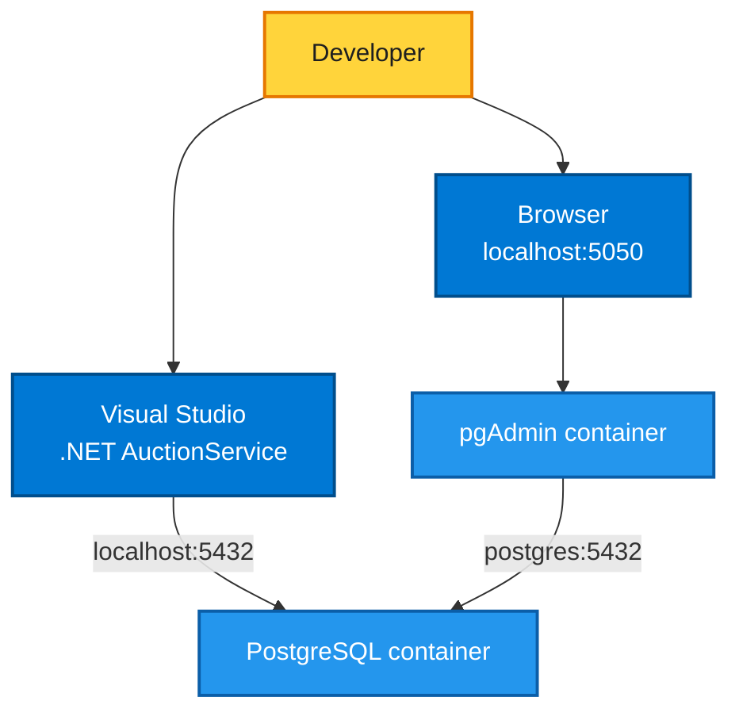
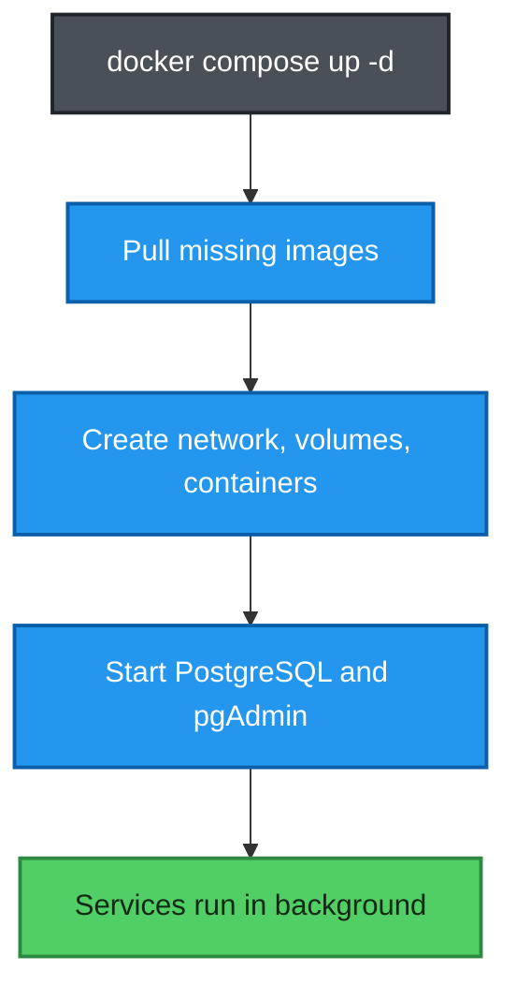
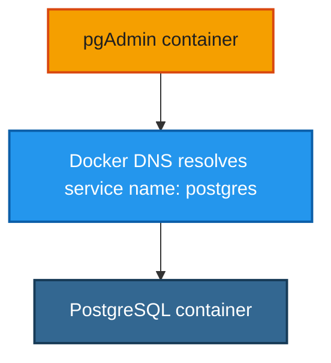
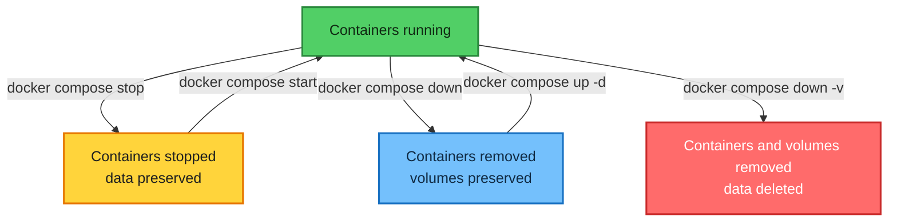
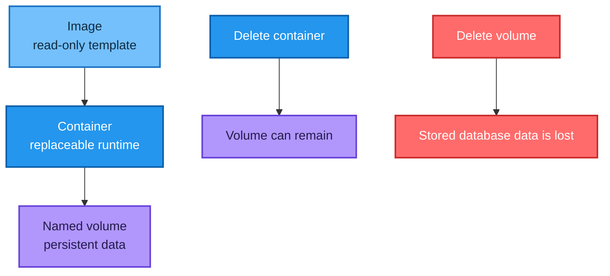
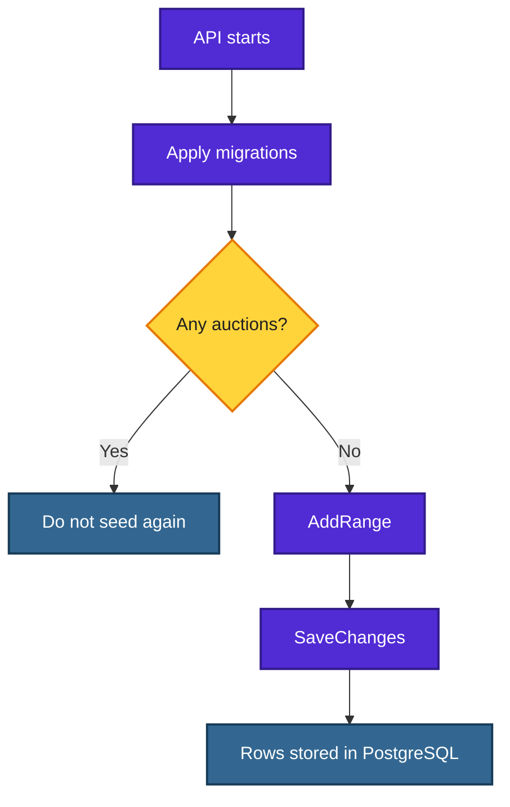

# Docker for Absolute Beginners

## A practical Windows 11 guide using PostgreSQL, pgAdmin, .NET, and Docker Compose

This tutorial assumes that you have **no previous Docker knowledge**. It uses a real project named **Carsties** as the main example.

By the end, you will understand:

- what Docker is and why developers use it;
- the difference between an image, a container, a volume, a network, and a service;
- how the Carsties `docker-compose.yml` file works;
- how Windows, PostgreSQL, pgAdmin, and the .NET API communicate;
- how to start, stop, inspect, recreate, and delete containers;
- how to apply EF Core migrations;
- how to view tables and data with pgAdmin or `psql`;
- how to understand and fix the errors encountered in this project.

> [!WARNING]
> The usernames and passwords in this tutorial are only for local development and learning. Do not use them in production and do not commit real secrets to GitHub.

---

## Table of contents

1. [The problem Docker solves](#1-the-problem-docker-solves)
2. [The most important Docker concepts](#2-the-most-important-docker-concepts)
3. [How the Carsties system works](#3-how-the-carsties-system-works)
4. [Project structure](#4-project-structure)
5. [The complete Compose file](#5-the-complete-compose-file)
6. [Understanding the Compose file line by line](#6-understanding-the-compose-file-line-by-line)
7. [Your first startup](#7-your-first-startup)
8. [Checking containers, ports, and logs](#8-checking-containers-ports-and-logs)
9. [EF Core migrations](#9-ef-core-migrations)
10. [Using pgAdmin](#10-using-pgadmin)
11. [Using PostgreSQL from the command line](#11-using-postgresql-from-the-command-line)
12. [The normal daily workflow](#12-the-normal-daily-workflow)
13. [Complete command reference](#13-complete-command-reference)
14. [Troubleshooting the errors from this project](#14-troubleshooting-the-errors-from-this-project)
15. [Volumes and data safety](#15-volumes-and-data-safety)
16. [How database initialization works in the .NET API](#16-how-database-initialization-works-in-the-net-api)
17. [Beginner exercises](#17-beginner-exercises)
18. [Glossary](#18-glossary)
19. [Cheat sheet](#19-cheat-sheet)
20. [Official references](#20-official-references)

---

## 1. The problem Docker solves

Without Docker, you might install PostgreSQL directly on Windows. Another developer might install a different PostgreSQL version on macOS. A third developer might use Linux with different settings.

This often causes the classic problem:

> “It works on my machine, but it does not work on your machine.”

Docker lets us describe the required software and configuration in files. Docker then runs that software in isolated environments called **containers**.

In Carsties:

- PostgreSQL runs in one container.
- pgAdmin runs in another container.
- The .NET API currently runs directly on Windows.
- Docker creates a private network so the two containers can communicate.
- Docker volumes preserve the PostgreSQL data and pgAdmin settings.



### Containers are not full virtual machines

A virtual machine usually contains a complete guest operating system. A container shares the host system's kernel technology and contains only what the application needs.

| Virtual machine | Container |
|---|---|
| Usually larger | Usually smaller |
| Often slower to start | Usually starts quickly |
| Contains a full guest OS | Packages the application and dependencies |
| Strong machine-level isolation | Process-level isolation |

Docker Desktop on Windows commonly uses a Linux environment through WSL 2 to run Linux containers such as PostgreSQL.

---

## 2. The most important Docker concepts

### 2.1 Docker Desktop

**Docker Desktop** is the Windows application that provides:

- the Docker Engine;
- the `docker` command-line tool;
- Docker Compose;
- a graphical interface for images, containers, volumes, and logs.

Docker Desktop must be running before Docker commands can communicate with the Docker Engine.

### 2.2 Docker client and Docker Engine

When you enter a command such as:

```powershell
docker compose up -d
```

the command does not run PostgreSQL itself. The Docker client sends a request to the Docker Engine. The engine performs the actual work.



### 2.3 Image

An **image** is a read-only template used to create containers.

Examples from this project:

```text
postgres:18
dpage/pgadmin4:latest
```

Think of an image as a class in C#.

```csharp
public class Car
{
}
```

The class describes what can be created, but the class is not a running object.

### 2.4 Container

A **container** is a running or stopped instance of an image.

Think of it as a C# object created from a class:

```csharp
var car = new Car();
```

In this project:

| Image | Container created from it |
|---|---|
| `postgres:18` | `carsties-postgres-1` |
| `dpage/pgadmin4:latest` | `carsties-pgadmin-1` |

An image can exist without a container. This happened when pgAdmin was downloaded but did not yet appear in `docker compose ps`.

### 2.5 Registry

A **registry** stores images. Docker Hub is the default public registry used in this tutorial.

When Docker sees:

```yaml
image: postgres:18
```

it downloads the image from a registry if the image is not already available locally.

### 2.6 Service

A **service** is a named component in a Compose file.

This project has two services:

```yaml
services:
  postgres:
  pgadmin:
```

Compose uses each service definition to create a container.

### 2.7 Volume

A container should be treated as replaceable. If important data exists only inside the container, removing the container can remove that data.

A **volume** stores data separately from the container.

This project uses:

```text
carsties_postgres_data
carsties_pgadmin_data
```



### 2.8 Network

Docker Compose creates a private network for the services in the file. In this project, its generated name is:

```text
carsties_default
```

Inside this network, containers find each other by **service name**.

Therefore pgAdmin connects to PostgreSQL with:

```text
Host: postgres
Port: 5432
```

It does **not** use `localhost` for this container-to-container connection.

### 2.9 Port mapping

A container has its own network space. Port mapping makes a container port accessible from Windows.

The format is:

```text
HOST_PORT:CONTAINER_PORT
```

Examples:

```yaml
- "5432:5432"
- "5050:80"
```

| Mapping | Meaning |
|---|---|
| `5432:5432` | Windows port 5432 forwards to PostgreSQL port 5432 |
| `5050:80` | Windows port 5050 forwards to pgAdmin's internal web port 80 |



### 2.10 Docker Compose

Docker Compose lets you define and run a multi-container application in a YAML file.

Instead of starting PostgreSQL and pgAdmin with two long commands, you describe both services once and run:

```powershell
docker compose up -d
```

---

## 3. How the Carsties system works

The current development architecture is:



There are two different database hostnames because the clients are in different places:

| Client | PostgreSQL host | Why |
|---|---|---|
| .NET API running on Windows | `localhost` | Windows reaches the published host port |
| pgAdmin running in Docker | `postgres` | Containers use the Compose service name |

The .NET connection string is therefore similar to:

```json
{
  "ConnectionStrings": {
    "DefaultConnection": "Host=localhost;Port=5432;Database=auctions;Username=postgres;Password=postgrespw"
  }
}
```

The pgAdmin connection uses:

```text
Host: postgres
Port: 5432
Database: auctions
Username: postgres
Password: postgrespw
```

---

## 4. Project structure

The Compose file should be in the solution root:

```text
Carsties/
├── Carsties.slnx
├── docker-compose.yml
└── AuctionService/
    ├── AuctionService.csproj
    ├── Program.cs
    ├── appsettings.json
    ├── Controllers/
    ├── Data/
    ├── Entities/
    └── Data/Migrations/
```

Run Compose commands from the directory that contains `docker-compose.yml`:

```powershell
cd C:\Workspace\Projects\Practices\Carsties
```

Command explanation:

| Part | Meaning |
|---|---|
| `cd` | Change directory |
| `C:\Workspace\Projects\Practices\Carsties` | Target directory |

List the files in the current PowerShell directory:

```powershell
Get-ChildItem
```

You should see items such as:

```text
AuctionService
Carsties.slnx
docker-compose.yml
```

> [!TIP]
> Use **View → Terminal** in Visual Studio for Docker commands. The Package Manager Console can display normal Docker progress output as a red `NativeCommandError`, even when the Docker command succeeds.

---

## 5. The complete Compose file

Create `docker-compose.yml` in the solution root:

```yaml
services:
  postgres:
    image: postgres:18
    environment:
      POSTGRES_USER: postgres
      POSTGRES_PASSWORD: postgrespw
      POSTGRES_DB: auctions
    ports:
      - "5432:5432"
    volumes:
      - postgres_data:/var/lib/postgresql

  pgadmin:
    image: dpage/pgadmin4:latest
    environment:
      PGADMIN_DEFAULT_EMAIL: admin@admin.com
      PGADMIN_DEFAULT_PASSWORD: adminpw
    ports:
      - "5050:80"
    volumes:
      - pgadmin_data:/var/lib/pgadmin
    depends_on:
      - postgres

volumes:
  postgres_data:
  pgadmin_data:
```

YAML is indentation-sensitive. Use spaces, not tabs.

---

## 6. Understanding the Compose file line by line

### 6.1 `services`

```yaml
services:
```

This begins the list of application services managed by Compose.

### 6.2 PostgreSQL service name

```yaml
  postgres:
```

`postgres` is the Compose service name. Other containers can use this word as a hostname.

It also influences the generated container name:

```text
carsties-postgres-1
```

The typical generated name consists of:

```text
PROJECT-SERVICE-INSTANCE
```

### 6.3 PostgreSQL image

```yaml
    image: postgres:18
```

| Part | Meaning |
|---|---|
| `image` | Image that Compose should use |
| `postgres` | Image repository/name |
| `18` | Image tag; here it selects PostgreSQL major version 18 |

Pinning a version is more reproducible than using `latest` for a database.

### 6.4 PostgreSQL environment variables

```yaml
    environment:
      POSTGRES_USER: postgres
      POSTGRES_PASSWORD: postgrespw
      POSTGRES_DB: auctions
```

These values are passed into the container when PostgreSQL initializes.

| Variable | Purpose |
|---|---|
| `POSTGRES_USER` | Creates the initial PostgreSQL user |
| `POSTGRES_PASSWORD` | Sets that user's password |
| `POSTGRES_DB` | Creates the initial database |

> [!IMPORTANT]
> These initialization values are mainly used when the PostgreSQL data directory is empty. Changing them later may not change an already initialized database because the old data remains in the volume.

### 6.5 PostgreSQL port mapping

```yaml
    ports:
      - "5432:5432"
```

The left side is the Windows host port. The right side is the port inside the container.

```text
localhost:5432 → container:5432
```

The quotes make the YAML value clearly behave as a string.

### 6.6 PostgreSQL volume mount

```yaml
    volumes:
      - postgres_data:/var/lib/postgresql
```

| Part | Meaning |
|---|---|
| `postgres_data` | Name of the Docker volume |
| `:` | Separates source and target |
| `/var/lib/postgresql` | Location inside the PostgreSQL 18 container |

PostgreSQL 18 stores its versioned cluster data below this location, for example under `/var/lib/postgresql/18/docker`.

### 6.7 pgAdmin service

```yaml
  pgadmin:
```

This defines the graphical PostgreSQL administration service.

### 6.8 pgAdmin image

```yaml
    image: dpage/pgadmin4:latest
```

| Part | Meaning |
|---|---|
| `dpage` | Image publisher/namespace |
| `pgadmin4` | Image name |
| `latest` | Most recent image assigned to that tag |

For a team project, pinning a tested version is usually safer than `latest` because `latest` can change.

### 6.9 pgAdmin environment variables

```yaml
    environment:
      PGADMIN_DEFAULT_EMAIL: admin@admin.com
      PGADMIN_DEFAULT_PASSWORD: adminpw
```

These values create the initial pgAdmin administrator account.

They are **not** the PostgreSQL username and password.

| Login | Purpose |
|---|---|
| `admin@admin.com` / `adminpw` | Log in to the pgAdmin website |
| `postgres` / `postgrespw` | Connect pgAdmin or the API to PostgreSQL |

### 6.10 pgAdmin port mapping

```yaml
    ports:
      - "5050:80"
```

pgAdmin listens on port `80` inside its container. Windows exposes it on port `5050`.

Open it with:

```text
http://localhost:5050
```

### 6.11 pgAdmin volume

```yaml
    volumes:
      - pgadmin_data:/var/lib/pgadmin
```

This preserves pgAdmin settings, sessions, and registered server connections.

### 6.12 `depends_on`

```yaml
    depends_on:
      - postgres
```

This tells Compose to start the PostgreSQL service before starting pgAdmin.

It controls startup order, but it does not guarantee that PostgreSQL is fully ready to accept connections. Production systems commonly add health checks and retry logic.

### 6.13 Top-level volumes

```yaml
volumes:
  postgres_data:
  pgadmin_data:
```

This declares two named volumes managed by Docker.

Compose prefixes their names with the project name, producing names such as:

```text
carsties_postgres_data
carsties_pgadmin_data
```

---

## 7. Your first startup

### Step 1: Confirm Docker is installed

```powershell
docker --version
```

Command explanation:

| Part | Meaning |
|---|---|
| `docker` | Docker command-line client |
| `--version` | Print the Docker version and exit |

Check Compose:

```powershell
docker compose version
```

| Part | Meaning |
|---|---|
| `docker` | Docker CLI |
| `compose` | Compose command group |
| `version` | Show the Compose version |

### Step 2: Validate the YAML configuration

```powershell
docker compose config
```

| Part | Meaning |
|---|---|
| `docker compose` | Use Docker Compose |
| `config` | Parse, validate, resolve, and print the effective configuration |

This command is useful for detecting indentation and configuration errors before starting containers.

### Step 3: Create and start the services

```powershell
docker compose up -d
```

| Part | Meaning |
|---|---|
| `up` | Create and start the services |
| `-d` | Detached mode; run in the background and return control to the terminal |

During the first run, Docker may:

1. download the images;
2. create the network;
3. create the volumes;
4. create the containers;
5. start the containers.



---

## 8. Checking containers, ports, and logs

### 8.1 Show running Compose containers

```powershell
docker compose ps
```

| Part | Meaning |
|---|---|
| `ps` | List containers belonging to the current Compose project |

Expected result:

```text
carsties-postgres-1   Up   0.0.0.0:5432->5432/tcp
carsties-pgadmin-1    Up   0.0.0.0:5050->80/tcp
```

### 8.2 Include stopped containers

```powershell
docker compose ps -a
```

| Part | Meaning |
|---|---|
| `-a` | Show all Compose containers, including stopped or failed containers |

This is important when a service starts and immediately exits.

### 8.3 Read PostgreSQL logs

```powershell
docker compose logs postgres
```

| Part | Meaning |
|---|---|
| `logs` | Display container output |
| `postgres` | Show logs only for the service named `postgres` |

The most important success message is:

```text
database system is ready to accept connections
```

Show only the last 30 lines:

```powershell
docker compose logs --tail 30 postgres
```

| Part | Meaning |
|---|---|
| `--tail 30` | Return only the last 30 log lines |

Show the last 100 pgAdmin lines:

```powershell
docker compose logs --tail 100 pgadmin
```

### 8.4 Check a container's published ports

```powershell
docker port carsties-postgres-1
```

| Part | Meaning |
|---|---|
| `docker port` | List port mappings for a container |
| `carsties-postgres-1` | Exact container name |

Expected output:

```text
5432/tcp -> 0.0.0.0:5432
5432/tcp -> [::]:5432
```

### 8.5 Test a port from Windows

```powershell
Test-NetConnection localhost -Port 5432
```

| Part | Meaning |
|---|---|
| `Test-NetConnection` | PowerShell network diagnostic command |
| `localhost` | This Windows computer |
| `-Port 5432` | Test TCP port 5432 |

Success:

```text
TcpTestSucceeded : True
```

Test pgAdmin:

```powershell
Test-NetConnection localhost -Port 5050
```

---

## 9. EF Core migrations

Docker starts PostgreSQL, but PostgreSQL initially does not know your C# entities. EF Core migrations create and update the database schema.

### 9.1 Build the .NET solution

```powershell
dotnet build
```

| Part | Meaning |
|---|---|
| `dotnet` | .NET command-line tool |
| `build` | Restore if necessary and compile the project/solution |

### 9.2 Create the first migration

Run this from the solution root shown earlier:

```powershell
dotnet ef migrations add InitialCreate -p AuctionService -s AuctionService -c AuctionDbContext -o Data/Migrations
```

Every part explained:

| Part | Meaning |
|---|---|
| `dotnet` | Start the .NET CLI |
| `ef` | Use the Entity Framework Core CLI tools |
| `migrations` | Work with migrations |
| `add` | Create a new migration |
| `InitialCreate` | Name of the new migration |
| `-p AuctionService` | Target project containing the `DbContext` and migration files |
| `-s AuctionService` | Startup project whose configuration and dependency injection are used |
| `-c AuctionDbContext` | Select this `DbContext` explicitly |
| `-o Data/Migrations` | Put generated files in this output directory inside the target project |

Only create `InitialCreate` once. Do not create it again each time you start Docker.

### 9.3 Apply migrations to PostgreSQL

```powershell
dotnet ef database update -p AuctionService -s AuctionService -c AuctionDbContext
```

| Part | Meaning |
|---|---|
| `database update` | Apply every pending migration to the configured database |
| `-p AuctionService` | Project containing migrations/context |
| `-s AuctionService` | Startup project |
| `-c AuctionDbContext` | Context to update |

This creates tables such as:

```text
Auctions
Items
__EFMigrationsHistory
```

### 9.4 List migrations

```powershell
dotnet ef migrations list -p AuctionService -s AuctionService -c AuctionDbContext
```

| Part | Meaning |
|---|---|
| `migrations list` | Show migrations known to the project and their status |

### 9.5 Check the EF tool version

```powershell
dotnet ef --version
```

If the global EF tool is missing:

```powershell
dotnet tool install --global dotnet-ef
```

| Part | Meaning |
|---|---|
| `tool install` | Install a .NET tool |
| `--global` | Make it available for the current user from any directory |
| `dotnet-ef` | Tool package name |

Update the global tool to a matching version:

```powershell
dotnet tool update --global dotnet-ef --version 10.0.12
```

| Part | Meaning |
|---|---|
| `tool update` | Update an installed tool |
| `--global` | Update the user's global installation |
| `--version 10.0.12` | Request this exact version |

Use a tool version compatible with the EF Core runtime packages in your project.

---

## 10. Using pgAdmin

Open:

```text
http://localhost:5050
```

Log in with the pgAdmin account:

```text
Email:    admin@admin.com
Password: adminpw
```

### 10.1 Register PostgreSQL in pgAdmin

In pgAdmin:

1. Right-click **Servers**.
2. Select **Register → Server**.
3. On **General**, enter:

```text
Name: Carsties PostgreSQL
```

4. On **Connection**, enter:

| Field | Value |
|---|---|
| Host name/address | `postgres` |
| Port | `5432` |
| Maintenance database | `auctions` |
| Username | `postgres` |
| Password | `postgrespw` |
| Save password | Enabled |

5. Select **Save**.

Why is the host `postgres`?



### 10.2 Find the tables

Expand:

```text
Servers
└── Carsties PostgreSQL
    └── Databases
        └── auctions
            └── Schemas
                └── public
                    └── Tables
```

If necessary, right-click **Tables** and select **Refresh**.

### 10.3 View rows

Right-click a table such as `Auctions`:

```text
View/Edit Data → All Rows
```

### 10.4 Run SQL

Select the `auctions` database and open **Tools → Query Tool**.

Examples:

```sql
SELECT * FROM "Auctions";
SELECT * FROM "Items";
SELECT * FROM "__EFMigrationsHistory";
```

PostgreSQL identifiers created with capital letters are quoted with double quotes.

### 10.5 Generate a graphical ER diagram

In the Object Explorer:

1. Right-click the `auctions` database, or the `public` schema.
2. Select **Generate ERD**.

The diagram displays:

- tables;
- columns and data types;
- primary keys;
- foreign-key relationships;
- relationship cardinality.

If you open **Tools → ERD Tool** without selecting an existing database or schema, pgAdmin may open an empty design canvas instead.

---

## 11. Using PostgreSQL from the command line

The `psql` program exists inside the PostgreSQL container. It was not installed directly on Windows, which is why this Windows command failed:

```powershell
psql -U postgres -d auctions
```

The error was:

```text
The term 'psql' is not recognized
```

Run `psql` inside the container instead:

```powershell
docker exec -it carsties-postgres-1 psql -U postgres -d auctions
```

Every part explained:

| Part | Meaning |
|---|---|
| `docker exec` | Execute a command inside an already running container |
| `-i` | Interactive mode; keep standard input open |
| `-t` | Allocate a terminal so the session behaves like a normal console |
| `carsties-postgres-1` | Container in which to run the command |
| `psql` | PostgreSQL command-line client |
| `-U postgres` | Connect as user `postgres` |
| `-d auctions` | Connect to database `auctions` |

When connected, the prompt looks like:

```text
auctions=#
```

Useful `psql` commands:

```sql
\dt
```

List tables in the current schema.

```sql
\d "Auctions"
```

Describe the `Auctions` table, including columns and constraints.

```sql
SELECT * FROM "Auctions";
```

Read every row and column from `Auctions`.

```sql
SELECT * FROM "Items";
```

Read every row and column from `Items`.

```sql
SELECT * FROM "__EFMigrationsHistory";
```

Show migrations applied by EF Core.

```sql
\q
```

Quit `psql` and return to PowerShell.

The commands beginning with a backslash are `psql` meta-commands and do not require a semicolon. SQL statements normally end with `;`.

---

## 12. The normal daily workflow

### Start work

```powershell
cd C:\Workspace\Projects\Practices\Carsties
docker compose up -d
docker compose ps
```

Then start `AuctionService` from Visual Studio.

### Stop work but keep everything

```powershell
docker compose stop
```

### Start the same stopped containers again

```powershell
docker compose start
```

### Remove containers but keep data

```powershell
docker compose down
```

Later, recreate the containers from the same Compose file:

```powershell
docker compose up -d
```

### Reset everything, including stored data

```powershell
docker compose down -v
```

> [!CAUTION]
> `-v` removes the named volumes. In this project it deletes the PostgreSQL database data and the saved pgAdmin configuration. Use it only when you intentionally want a clean reset.



---

## 13. Complete command reference

This section includes the commands used during the Carsties setup and troubleshooting.

### 13.1 Image and service downloads

Download the image for only the pgAdmin service:

```powershell
docker compose pull pgadmin
```

| Part | Meaning |
|---|---|
| `pull` | Download service images without starting containers |
| `pgadmin` | Limit the operation to the `pgadmin` service |

Start only pgAdmin and required dependencies:

```powershell
docker compose up -d pgadmin
```

`pgadmin` limits the target service. Because pgAdmin depends on PostgreSQL, Compose also ensures the dependency is running.

### 13.2 Force container recreation

```powershell
docker compose up -d --force-recreate
```

| Option | Meaning |
|---|---|
| `--force-recreate` | Recreate containers even when Compose thinks their configuration has not changed |

Recreate only pgAdmin:

```powershell
docker compose up -d --force-recreate pgadmin
```

This was useful after changing `PGADMIN_DEFAULT_EMAIL`.

### 13.3 Inspect all Docker containers

```powershell
docker ps -a
```

| Part | Meaning |
|---|---|
| `docker ps` | List Docker containers across projects |
| `-a` | Include stopped containers |

Show running containers that publish host port 5432:

```powershell
docker ps --filter "publish=5432"
```

| Part | Meaning |
|---|---|
| `--filter` | Restrict the results |
| `"publish=5432"` | Match containers publishing host port 5432 |

This found the old container:

```text
lilishopdataaccess-db-1
```

### 13.4 Stop and remove one exact container

```powershell
docker stop lilishopdataaccess-db-1
```

| Part | Meaning |
|---|---|
| `stop` | Request a graceful container stop |
| `lilishopdataaccess-db-1` | Exact container target |

Remove the stopped container:

```powershell
docker rm lilishopdataaccess-db-1
```

| Part | Meaning |
|---|---|
| `rm` | Remove a container object |

Removing a container does not automatically remove a separately managed named volume.

### 13.5 Check what uses a Windows port

Docker-specific check:

```powershell
docker ps --filter "publish=5432"
```

Windows network check:

```powershell
Get-NetTCPConnection -LocalPort 5432 -State Listen
```

| Part | Meaning |
|---|---|
| `Get-NetTCPConnection` | List Windows TCP connections/endpoints |
| `-LocalPort 5432` | Filter by local port 5432 |
| `-State Listen` | Show processes listening for new connections |

Use the returned `OwningProcess` value:

```powershell
Get-Process -Id 1234
```

| Part | Meaning |
|---|---|
| `Get-Process` | Show process information |
| `-Id 1234` | Select the process with PID 1234 |

Traditional Windows alternative:

```powershell
netstat -ano | findstr :5432
```

| Part | Meaning |
|---|---|
| `netstat` | Display network connections and listening ports |
| `-a` | Show all connections and listening ports |
| `-n` | Show numerical addresses and ports |
| `-o` | Show the owning process ID |
| `|` | Send the output of the first command into the second command |
| `findstr :5432` | Keep lines containing `:5432` |

### 13.6 Change the host port when 5432 is busy

Change:

```yaml
ports:
  - "5432:5432"
```

to:

```yaml
ports:
  - "5433:5432"
```

Then update the .NET connection string:

```text
Host=localhost;Port=5433;Database=auctions;Username=postgres;Password=postgrespw
```

Do not change the container-side PostgreSQL port unless you also reconfigure PostgreSQL itself.

### 13.7 Compose logs and status commands

```powershell
docker compose ps
docker compose ps -a
docker compose logs postgres
docker compose logs pgadmin
docker compose logs --tail 30 postgres
docker compose logs --tail 100 pgadmin
```

### 13.8 Compose lifecycle commands

```powershell
docker compose up -d
docker compose stop
docker compose start
docker compose down
docker compose down -v
```

| Command | Containers | Network | Named volumes | Data result |
|---|---:|---:|---:|---|
| `stop` | Kept, stopped | Kept | Kept | Preserved |
| `start` | Kept, started | Kept | Kept | Preserved |
| `down` | Removed | Removed | Kept | Preserved |
| `down -v` | Removed | Removed | Removed | Deleted |

---

## 14. Troubleshooting the errors from this project

### 14.1 `Bind for 0.0.0.0:5432 failed: port is already allocated`

#### Meaning

Only one process can normally bind the same host IP and TCP port combination. Another container was already using Windows port 5432.

#### Find it

```powershell
docker ps --filter "publish=5432"
```

#### Safe choices

1. Stop the old container if you no longer need it.
2. Use another host port, such as `5433:5432`.

In this project, the old container was deliberately stopped and removed:

```powershell
docker stop lilishopdataaccess-db-1
docker rm lilishopdataaccess-db-1
```

### 14.2 `NativeCommandError` in Visual Studio Package Manager Console

Example:

```text
CategoryInfo : NotSpecified
FullyQualifiedErrorId : NativeCommandError
```

Docker writes some progress messages to the standard error stream. The Package Manager Console can render these normal messages in red.

Always read the final Docker lines. These indicate success:

```text
Container carsties-pgadmin-1 Started
Image dpage/pgadmin4:latest Pulled
```

Use **View → Terminal** for clearer Docker output.

### 14.3 Container shows only `5432/tcp`, without `0.0.0.0:5432->5432/tcp`

#### Meaning

The container port exists, but the host mapping may not be active.

#### Diagnose

```powershell
docker compose config
docker port carsties-postgres-1
```

#### Recreate

```powershell
docker compose down
docker compose up -d --force-recreate
```

Then verify:

```powershell
docker compose ps
docker port carsties-postgres-1
Test-NetConnection localhost -Port 5432
```

### 14.4 `Failed to connect to 127.0.0.1:5432`

#### Meaning

No PostgreSQL server was reachable at that address and port.

#### Checklist

```powershell
docker compose ps
docker compose logs --tail 30 postgres
docker port carsties-postgres-1
Test-NetConnection localhost -Port 5432
```

Also verify the .NET connection string.

### 14.5 `psql` is not recognized

#### Meaning

`psql` is not installed on the Windows `PATH`.

#### Solution

Use the copy that already exists inside the PostgreSQL container:

```powershell
docker exec -it carsties-postgres-1 psql -U postgres -d auctions
```

### 14.6 pgAdmin image exists, but no pgAdmin container exists

#### Meaning

An image was pulled, but a container was not created or started.

#### Solution

```powershell
docker compose up -d pgadmin
docker compose ps -a
```

### 14.7 pgAdmin container has `Exited (1)`

Inspect its logs:

```powershell
docker compose logs --tail 100 pgadmin
```

The actual error in this project was:

```text
'admin@carsties.local' does not appear to be a valid email address
```

`.local` is a special-use domain rejected by pgAdmin's validation. The value was changed to:

```yaml
PGADMIN_DEFAULT_EMAIL: admin@admin.com
```

Then pgAdmin was recreated:

```powershell
docker compose up -d --force-recreate pgadmin
```

### 14.8 `http://localhost:5050` shows nothing

Check the following:

```powershell
docker compose ps -a
Test-NetConnection localhost -Port 5050
docker compose logs --tail 100 pgadmin
```

Requirements:

- the pgAdmin status must be `Up`;
- the port mapping must include `0.0.0.0:5050->80/tcp`;
- the port test must return `True`.

### 14.9 EF Core first reports a failed `__EFMigrationsHistory` query

After deleting the database volume, the history table does not exist yet. EF Core may first attempt:

```sql
SELECT "MigrationId", "ProductVersion"
FROM "__EFMigrationsHistory"
ORDER BY "MigrationId";
```

If the log continues with:

```text
Applying migration '..._InitialCreate'.
Application started.
```

then EF Core recovered normally, created the schema, and the application started successfully.

### 14.10 EF tools version is older than the runtime

Example:

```text
The Entity Framework tools version '10.0.10' is older than that of the runtime '10.0.12'.
```

This warning was not the cause of the database connection failure. Update the tool separately:

```powershell
dotnet tool update --global dotnet-ef --version 10.0.12
```

### 14.11 Database or pgAdmin settings disappeared

The command:

```powershell
docker compose down -v
```

removed both named volumes:

```text
carsties_postgres_data
carsties_pgadmin_data
```

Consequences:

- PostgreSQL data was deleted.
- pgAdmin's registered server was deleted.
- EF migration files in the source code were not deleted.

Recovery for the database structure:

```powershell
docker compose up -d
dotnet ef database update -p AuctionService -s AuctionService -c AuctionDbContext
```

Then register the PostgreSQL server in pgAdmin again.

---

## 15. Volumes and data safety

### Container lifetime and volume lifetime are different



### Recommended choices

| Goal | Command |
|---|---|
| Pause work | `docker compose stop` |
| Continue work | `docker compose start` |
| Recreate containers but preserve data | `docker compose down` then `docker compose up -d` |
| Completely reset local database and pgAdmin | `docker compose down -v` |

Before removing volumes that contain important data, create a backup.

---

## 16. How database initialization works in the .NET API

The application can run initialization code before `app.Run()`:

```csharp
app.MapControllers();

try
{
    DbInitializer.InitDb(app);
}
catch (Exception e)
{
    Console.WriteLine($"Error initializing database: {e.Message}");
}

app.Run();
```

Inside the initializer:

```csharp
context.Database.Migrate();
```

This applies pending EF Core migrations.

The initializer can then check whether seed data already exists:

```csharp
if (context.Auctions.Any())
{
    Console.WriteLine("Seed data already exists.");
    return;
}
```

Finally, it adds and saves test data:

```csharp
context.Auctions.AddRange(auctions);
context.SaveChanges();
```

The difference is important:

| Method | What it does |
|---|---|
| `AddRange(auctions)` | Tracks the new objects in EF Core memory |
| `SaveChanges()` | Sends SQL commands and persists the objects in PostgreSQL |

Without `SaveChanges()`, the seed records do not appear in the database.



For a tutorial and local development, automatic migration and seeding are convenient. Production systems need a carefully controlled migration strategy.

---

## 17. Beginner exercises

### Exercise 1: Identify images and containers

1. Open Docker Desktop.
2. Open **Images**.
3. Find `postgres:18` and `dpage/pgadmin4`.
4. Open **Containers**.
5. Find the containers created from those images.

Question: Why can an image exist when no container is running?

### Exercise 2: Stop and start safely

```powershell
docker compose stop
docker compose ps -a
docker compose start
docker compose ps
```

Observe how the container state changes while the volumes remain.

### Exercise 3: Inspect logs

```powershell
docker compose logs --tail 20 postgres
docker compose logs --tail 20 pgadmin
```

Find the lines that indicate each service is ready.

### Exercise 4: Query the database with `psql`

```powershell
docker exec -it carsties-postgres-1 psql -U postgres -d auctions
```

Then:

```sql
\dt
SELECT COUNT(*) FROM "Auctions";
SELECT COUNT(*) FROM "Items";
\q
```

### Exercise 5: Verify persistence

1. Confirm that seed data exists.
2. Run:

```powershell
docker compose down
docker compose up -d
```

3. Check the rows again.

They should still exist because the named volume was preserved.

### Exercise 6: Read the port mappings

```powershell
docker compose ps
```

Explain these mappings in your own words:

```text
0.0.0.0:5432->5432/tcp
0.0.0.0:5050->80/tcp
```

---

## 18. Glossary

| Term | Simple meaning |
|---|---|
| Docker | Platform for building and running containerized software |
| Docker Desktop | Windows/macOS application containing Docker Engine, CLI, Compose, and GUI tools |
| Docker Engine | Background service that manages Docker resources |
| Docker CLI | The `docker` command used to talk to the engine |
| Image | Read-only template used to create containers |
| Container | Runnable instance of an image |
| Registry | Server that stores Docker images |
| Docker Hub | Default public Docker image registry |
| Service | Named application component in a Compose file |
| Docker Compose | Tool for defining and running multiple services |
| YAML | Human-readable configuration format used by Compose |
| Volume | Docker-managed persistent storage |
| Network | Communication channel connecting containers |
| Port | Number identifying a network endpoint |
| Port mapping | Connection from a host port to a container port |
| Host | Your Windows computer in this tutorial |
| `localhost` | The current machine from the caller's point of view |
| Detached mode | Background execution enabled with `-d` |
| Environment variable | Configuration value passed into a process/container |
| PostgreSQL | Relational database server |
| pgAdmin | Graphical administration tool for PostgreSQL |
| `psql` | PostgreSQL command-line client |
| EF Core migration | Versioned database schema change generated from .NET models/configuration |
| Seed data | Initial sample or required data inserted into a database |

---

## 19. Cheat sheet

### Start everything

```powershell
cd C:\Workspace\Projects\Practices\Carsties
docker compose up -d
docker compose ps
```

### Check readiness

```powershell
docker compose logs --tail 30 postgres
docker compose logs --tail 30 pgadmin
Test-NetConnection localhost -Port 5432
Test-NetConnection localhost -Port 5050
```

### Open tools

```text
pgAdmin: http://localhost:5050
API:     http://localhost:7001
```

### Apply migrations

```powershell
dotnet ef database update -p AuctionService -s AuctionService -c AuctionDbContext
```

### Open PostgreSQL CLI

```powershell
docker exec -it carsties-postgres-1 psql -U postgres -d auctions
```

### Stop safely

```powershell
docker compose stop
```

### Resume

```powershell
docker compose start
```

### Remove containers but preserve data

```powershell
docker compose down
```

### Delete containers and all local Docker data for this Compose project

```powershell
docker compose down -v
```

> [!CAUTION]
> The last command deletes the PostgreSQL and pgAdmin volumes.

---

## 20. Official references

- [Docker overview](https://docs.docker.com/get-started/docker-overview/)
- [Docker Compose command reference](https://docs.docker.com/reference/cli/docker/compose/)
- [Docker volumes](https://docs.docker.com/engine/storage/volumes/)
- [pgAdmin container deployment](https://www.pgadmin.org/docs/pgadmin4/latest/container_deployment.html)
- [pgAdmin ERD Tool](https://www.pgadmin.org/docs/pgadmin4/latest/erd_tool.html)
- [EF Core .NET CLI tools](https://learn.microsoft.com/ef/core/cli/dotnet)

---

## Final mental model

Remember this short summary:

```text
Image      = template
Container  = running or stopped instance
Volume     = persistent data
Network    = communication between containers
Port       = access point
Compose    = configuration and lifecycle manager for multiple services
```

For Carsties:

```text
postgres:18 image
    → carsties-postgres-1 container
    → carsties_postgres_data volume

dpage/pgadmin4 image
    → carsties-pgadmin-1 container
    → carsties_pgadmin_data volume
```

The containers are replaceable. The volumes preserve the state. The Compose file describes how everything should be recreated.
